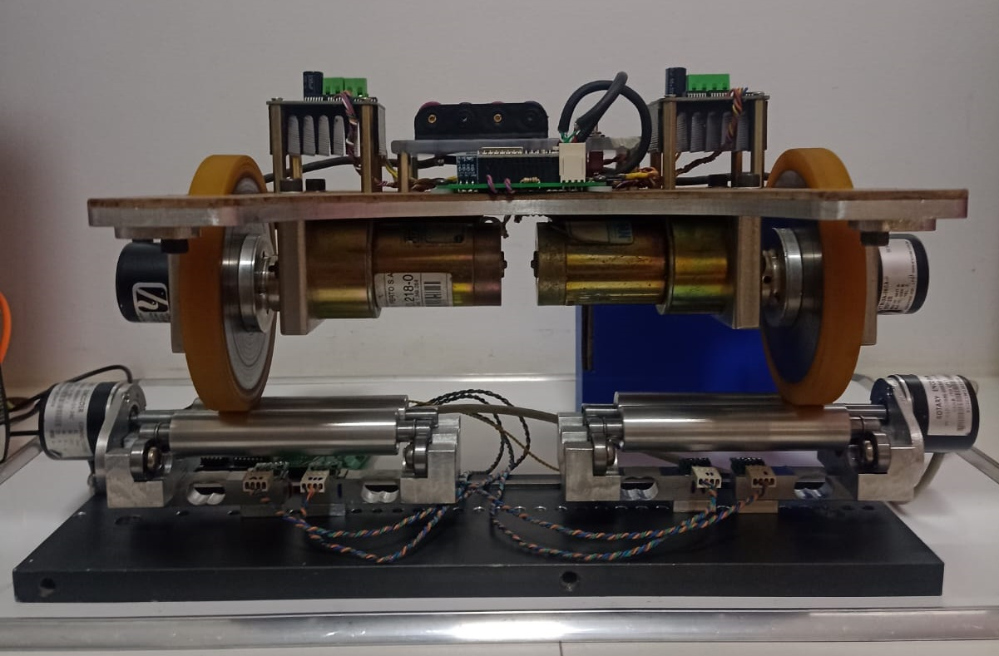
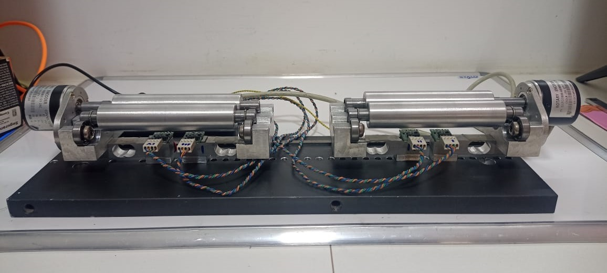
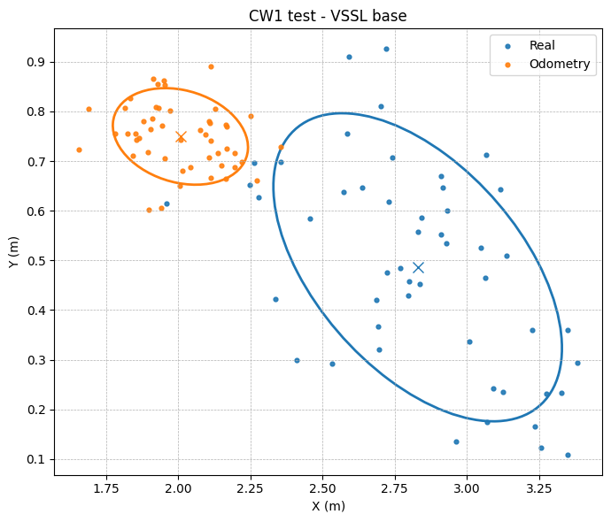
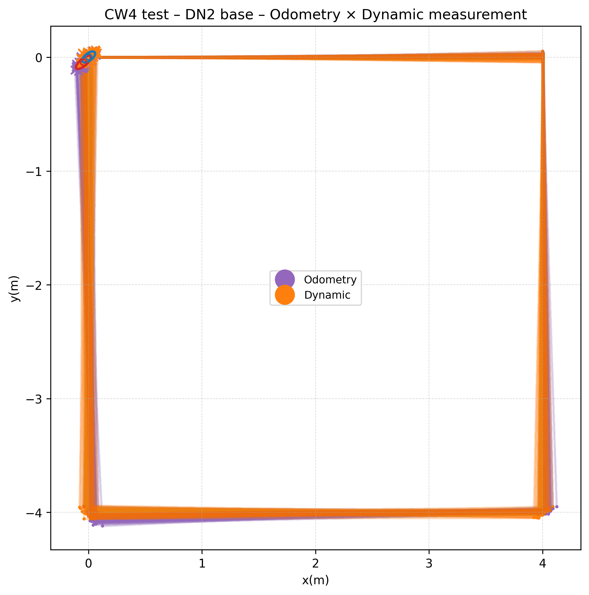

# RobotLab – Isostatic Platform for Dynamic Odometry Modeling

This repository contains the source code and dataset used in the development and validation of an isostatic platform for dynamic wheel-separation modeling in differential-drive mobile robots (DDMR).

The project investigates whether wheel separation can be treated as a measurable time-varying parameter, improving adherence between controlled experiments and real-world motion.

  
  

---

## 📌 Project Overview

Classical odometric models assume constant geometric parameters.  
This platform enables continuous measurement of effective wheel separation during motion, allowing dynamic modeling of kinematic behavior.

The repository includes:

- Embedded acquisition and control code
- Experimental routines
- Statistical analysis scripts
- Full dataset used in validation
- Visual outputs from experiments

---

## 🎥 Platform Demonstration

- ▶ Platform operation  
  https://youtube.com/shorts/yNNR_Anz_zs?feature=share

- ▶ Dynamic measurement demonstration  
  https://youtube.com/shorts/b1wMfQmdOxw?feature=share

- ▶ Experimental routine execution  
  https://youtube.com/shorts/e7BCnc3Zn1o?feature=share

---

## 📊 Position Dispersion Example

Below is an example of dispersion of final pose estimates:

  

This figure represents the statistical spread of final $(x, y, \theta)$ values obtained during repeated experimental runs.

---

## 📈 Platform Visual Output Example

Example of visual data obtained from the isostatic platform:

  

This figure demonstrates the correlation between structural measurements and odometric estimates.

---

## 🗂 Dataset

All experimental data used in the study are available in:

The dataset includes:

- Raw encoder readings
- Load cell measurements
- Computed wheel separation values
- Final pose estimations
- Statistical outputs

This ensures full reproducibility of the reported results.

---

## 🔬 Scientific Contribution

This repository supports:

- Dynamic modeling of wheel separation
- Experimental validation of geometric variability
- Improved odometric adherence to real-world motion
- Foundations for integration into state estimation and SLAM pipelines

---

## 👨‍💻 Authors

Darci Luiz Tomasi Junior  
Eduardo Todt  

Federal University of Paraná (UFPR)

---
## 📜 License

This project is licensed under the MIT License.  
See the [LICENSE](./LICENSE) file for details.
